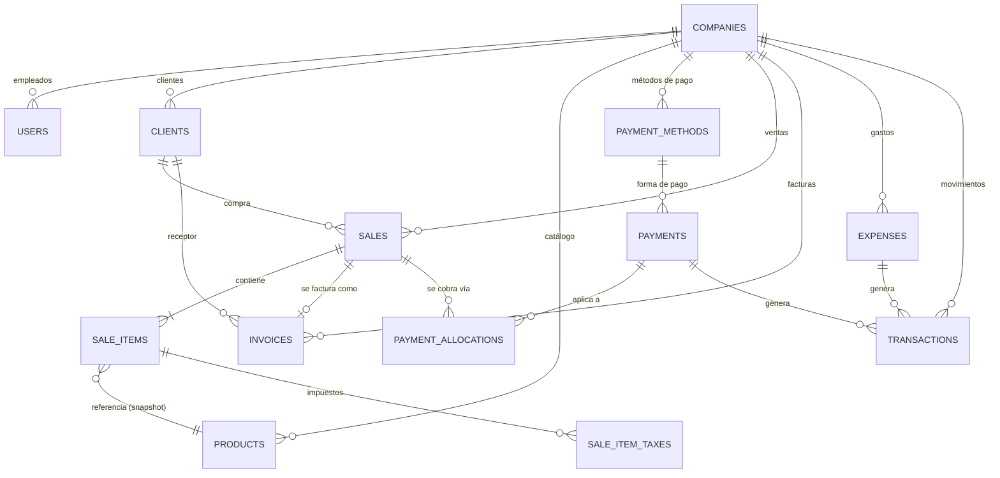

# ERP_ARCHITECTURE_PLAN.md
## Plan de Arquitectura — ERP Financiero Multiempresa (México)

> Estado: Fase 0 — Análisis. Ningún código, migración o modelo ha sido modificado.
> Alcance: `api-v1` (Laravel 12 + MySQL) y `app-front` (Next.js 15 + React + TS + Tailwind).

---

## 0. Resumen Ejecutivo

El backend actual (`api-v1`) es un **MVP de facturación de un solo tenant** construido antes de que existiera el concepto de multiempresa. Se agregó después una tabla `companies` y `users.company_id`, pero esa propagación **nunca llegó** a `clients`, `products`, `employes` ni `invoices`: hoy cualquier empresa puede leer, editar y borrar los datos de cualquier otra. El modelo `Company` ya declara relaciones hacia `Branch`, `Warehouse`, `Customer`, `Supplier`, `Quote`, `Payment`, `Setting` — módulos "aspiracionales" cuyas clases y tablas **no existen**. No hay ninguna integración con Facturapi ni con ningún PAC: `Invoice` es un registro local tipo ticket, sin folio fiscal, UUID, XML, PDF ni estado de cancelación real.

El frontend (`app-front`) tiene una capa visual muy completa y fiel al dominio CFDI mexicano (formularios de factura, catálogos SAT completos, series/folios, CSD), pero la mayoría de esos módulos son **100% mock**, sin conexión al backend. Solo **Clientes, Productos, Usuarios y Auth** están realmente integrados — son los flujos que no se pueden romper durante la migración.

Este documento propone: (1) cerrar la brecha de multi-tenancy sin romper nada de lo que ya funciona, (2) un modelo de datos objetivo para Ventas/Cobros/Facturación real/Finanzas/Contabilidad, y (3) un roadmap por fases y sprints, en el orden que el usuario ya definió (Fase 0 → 5).

---

## 1. Arquitectura Actual

### 1.1 Backend (`api-v1`, Laravel 12)

**Tablas existentes** (`database/migrations/`):

| Tabla | company_id | Soft Deletes | Notas |
|---|:---:|:---:|---|
| `users` | ✅ (NOT NULL, FK cascade) | ✅ | Único vínculo de tenant real. `email` único **global**. `role` (admin/accountant/sales/employee) y `status` cast a enum pero nunca evaluados en autorización. Auth por `api_token` (hash SHA-256, TokenGuard nativo de Laravel — **no Sanctum/Passport**). 2FA vía Fortify. |
| `companies` | — (es el tenant) | ✅ | `id` autoincrement + `uuid` (columna secundaria única, no PK). Ya tiene columnas para branding, config regional, y placeholders fiscales: `fiscal_provider` (enum `sat\|pac\|custom` — **sin case `facturapi`**), `sandbox`, `api_key`, `integration_status`. `plan` es un string suelto sin tabla `plans`/`subscriptions`. |
| `clients` | ❌ | ✅ | Catálogo de clientes CFDI (RFC, régimen fiscal, uso CFDI, domicilio). `email` y `rfc` únicos **globales**. |
| `products` | ❌ | ✅ | Catálogo de productos/servicios SAT (clave_producto, clave_unidad, IVA/IEPS/ISR/IVA retenido como **columnas planas**, no catálogo relacional). `clave_producto` y `no_identificacion` únicos **globales**. |
| `employes` | ❌ | ✅ | Catálogo de nómina/RH mexicana completo (CURP, RFC, seguro social, salario diario, cuenta bancaria). `rfc`, `curp`, `seguro_social`, `clave_bancaria`, `no_empleado` únicos **globales**. (Nombre de tabla con typo heredado: `employes`, no `employees`.) |
| `invoices` | ❌ | ✅ | Se creó vacía y se le añadieron columnas después. Mezcla "venta" y "documento fiscal" en una sola tabla: `items`/`payment`/`options`/`client_snapshot` son JSON libre, sin tabla `sale_items`. `invoice_number` es un folio local (`TCK-YYYYMMDD-XXXXXX`), **no un folio fiscal real**. Sin `uuid_fiscal`, sin XML/PDF, sin estado de cancelación. |
| `audit_logs` | ✅ (nullable) | — | `user_id` (dueño del cambio) + `actor_id` (quién ejecutó) + `action` (enum) + `metadata` JSON. Solo se usa desde el módulo de Usuarios. Sin `updated_at` (timestamps=false). |

Tablas estándar de Laravel sin relevancia de negocio: `password_reset_tokens`, `sessions`, `cache`, `cache_locks`, `jobs`, `job_batches`, `failed_jobs`.

**Modelos Eloquent** (`app/Models/`): `User`, `Company`, `Client`, `Product`, `Employe`, `Invoice`, `AuditLog`. Ninguno de `Client`/`Product`/`Employe`/`Invoice` tiene relación `belongsTo(Company)` ni `company_id` en `$fillable` (coincide con el schema). `Company` declara `HasMany` hacia `branches()`, `warehouses()`, `customers()`, `suppliers()`, `settings()`, `quotes()`, `payments()` — **ninguna de esas clases existe** en `app/Models`; invocarlas rompería en runtime (`Class not found`). `User` declara `organizations(): HasMany` hacia un modelo `Organization` que tampoco existe.

**Rutas y controllers** (`routes/api.php`, `app/Http/Controllers/Api/`): CRUD estándar para `AuthController`, `ClientController`, `ProductController`, `EmployeController`, `InvoiceController`, `UserController`, `UserSecurityController`. Todas las rutas (salvo `/login`) usan `auth:api` + `throttle:60,1`. **Solo `UserController`/`UserSecurityController` filtran por `company_id`** (patrón manual `where('company_id', $authUser->company_id)` / helper privado `findWithinCompany()`, duplicado en ambos controllers, sin trait ni scope reutilizable). `Client`/`Product`/`Employe`/`Invoice` hacen `Model::all()` / `findOrFail()` **sin ningún filtro de tenant**.

No existen Form Requests ni API Resources para Client/Product/Employe/Invoice (validación inline con `$request->validate()`, se serializa el modelo Eloquent crudo). Sí existen para Usuarios: `StoreUserRequest`, `UpdateUserRequest`, `ChangePasswordRequest`, y los Resources `UserResource`/`CompanyResource` — este es el **patrón de referencia a replicar** en Fase 1.

**Autorización**: no existe `app/Policies`, no hay Gates, no hay middleware de rol. El enum `UserRole` se persiste pero nunca se evalúa. Todos los `authorize()` de los Form Requests devuelven `true` fijo.

**Multi-tenancy "fantasma"**: `TenantMiddleware` (registrado globalmente en `bootstrap/app.php`, grupos `web` y `api`) solo copia `$request->user()->company` a `$request->attributes`. `TenantService` expone `current()`/`currentId()`/`hasCompany()` leyendo esos atributos. **Ningún controller de negocio los usa** — es infraestructura preparada pero desconectada.

**Integración fiscal**: cero. No hay paquete Composer, service, config ni columnas de resultado de timbrado. `InvoiceController::store()` no llama a ningún PAC.

**Auth**: guard `api` = TokenGuard nativo de Laravel (`driver: token`, hash del `api_token` en `users`). Convive con Fortify + sesión (`guard web`) para un flujo Inertia (`routes/web.php`, `routes/settings.php`) que el frontend real (`app-front`) no usa — parece scaffolding del starter kit. El registro de Fortify (`CreateNewUser`) no asigna `company_id`, que es `NOT NULL` — rompería si ese flujo se usara.

### 1.2 Frontend (`app-front`, Next.js 15 App Router)

Sin cliente HTTP centralizado (helpers dispersos por dominio en `src/services/*.services.ts`, cada uno repite su propio manejo de token/headers). Sin protección de rutas (no hay `middleware.ts`; cualquier página es navegable sin sesión). Sin selector de empresa activa (`AuthUser.company` es un objeto único, no un arreglo).

| Módulo | Estado real | Evidencia |
|---|---|---|
| Auth (login/logout/perfil) | **Conectado** a `/api/login`, `/api/user`, `/api/logout` | `src/services/auth.services.ts` |
| Clientes | **Conectado**, CRUD completo | `app/pages/catalogs/clients`, `client.services.ts` |
| Productos | **Conectado**, CRUD completo | `app/pages/catalogs/products`, `product.services.ts` |
| Usuarios | **Conectado**, el más maduro (roles, estados, contraseñas, sesiones) | `app/pages/catalogs/usuarios`, `useUsers.ts`, `users.ts` |
| Dashboard | Mock 100%, sin llamadas a API | `app/pages/dashboard` |
| Facturación CFDI (crear/consultar/descargar/masiva/recuperación/XML) | Mock 100% (emisor hardcodeado "KASHMIR") | `app/pages/invoices/*` |
| Cuentas por cobrar/pagar, Libro Diario | Mock 100% (bug detectado: la página de "Cuentas por Cobrar" tiene el componente y el `<h1>` nombrados "Cuentas por Pagar", copy-paste sin actualizar) | `app/pages/accounts/*` |
| Estadísticas/Reportes | Mock 100% | `app/pages/statistics/*` |
| Empleados | Mock 100% (el backend sí tiene CRUD de `employes`, pero el frontend no lo consume) | `app/pages/catalogs/employee` |
| Configuración (sellos/CSD, expedición, bancos, series, addenda, observaciones) | Mock 100%, salvo las estadísticas agregadas del hub (`SettingsStats.tsx`, sí real) | `app/pages/settings/*` |
| Cotizaciones, Ventas, Cobranza, Servicios, Impuestos (como módulo), Estado de Cuenta | **No existen como página** — solo entradas de menú en `MenuItems.tsx` que producen 404, o ni siquiera están enlazadas | `MenuItems.tsx` |

El menú lateral (`MenuItems.tsx`) ya define la taxonomía objetivo del ERP (VENTAS, CONTACTOS, CATÁLOGO, FINANZAS, EMPRESA, ANÁLISIS, SISTEMA), útil como guía de navegación futura. Código muerto detectado (no bloquea nada, limpieza de bajo riesgo para cuando convenga): `lib/api.ts` (el propio archivo dice "ya no se usa"), `src/js/clients.js` (import roto, nada lo referencia), `app/pages/settings/users/page.tsx` (versión mock huérfana, reemplazada por `catalogs/usuarios`).

### 1.3 Relación actual Facturapi ↔ Ventas

No existe. `Invoice` es simultáneamente "venta" y "factura" en una sola tabla con `items` JSON. No hay concepto de venta previo a la factura, ni de cobro, ni de timbrado.

---

## 2. Problemas de Arquitectura Detectados

**Multi-tenancy (crítico — riesgo de fuga de datos entre empresas)**
1. `clients`, `products`, `employes`, `invoices` no tienen `company_id`: cualquier usuario autenticado de cualquier empresa puede leer/editar/borrar los datos de **todas** las empresas del SaaS.
2. Unicidad global en BD (`clients.email`, `clients.rfc`, `products.clave_producto`, `products.no_identificacion`, `employes.seguro_social`, `employes.clave_bancaria`, `employes.rfc`, `employes.curp`, `employes.no_empleado`) impide que dos empresas distintas tengan, por ejemplo, un cliente con el mismo RFC — un bloqueo funcional real en cuanto haya 2 empresas activas.
3. El scoping por tenant que sí existe (`UserController`) se implementa a mano, duplicado método por método, sin trait/Global Scope reutilizable — no escala a los ~10 módulos nuevos del roadmap.
4. `TenantMiddleware`/`TenantService` están registrados pero no conectados a ningún controller de negocio — falsa sensación de que el aislamiento ya existe.
5. El modelo de tenant es 1 usuario → 1 empresa fija (FK). Correcto para el MVP actual, pero **no hay diseño previsto** para si en el futuro un contador necesita acceso a varias empresas (fuera de alcance de este roadmap, se documenta como limitación conocida).

**Relaciones y modelos rotos**
6. `Company` declara `branches()`, `warehouses()`, `customers()`, `suppliers()`, `settings()`, `quotes()`, `payments()` hacia clases que no existen — código muerto que rompería en runtime si se invocara.
7. `User` declara `organizations()` hacia un modelo `Organization` inexistente.

**Autorización**
8. No hay Policies ni Gates. El enum `UserRole` (admin/accountant/sales/employee) se persiste pero nunca se usa para restringir nada — cualquier usuario, sin importar su rol, puede crear otros administradores o borrar clientes/productos.
9. Los `authorize()` de todos los Form Requests devuelven `true` fijo.

**Normalización / modelo de datos**
10. Los impuestos de `products` son columnas planas (`iva`, `iva_retenido`, `ieps`, `isr` decimales) — no pueden representar "Exento" (distinto de 0%) ni impuestos múltiples por línea, ambos requeridos por CFDI real.
11. `invoices.items`/`payment`/`options`/`client_snapshot` son JSON libre — imposible de indexar o agregar (`SUM`/`GROUP BY`) para los reportes de IVA/ISR que pide la Fase 5.
12. No existe tabla de "ventas" separada de "facturas": mezclar ambos conceptos impide vender sin facturar (mostrador, anticipos) y complica la cancelación/sustitución de CFDI.

**Integración fiscal**
13. Cero integración con Facturapi/PAC: sin paquete, sin service, sin jobs asíncronos, sin columnas de folio fiscal/UUID/XML/PDF/estado de cancelación. Construir esto es, en la práctica, empezar desde cero (no hay nada que migrar de código, solo datos).
14. El enum `CompanyFiscalProvider` no tiene case `Facturapi` (solo `sat|pac|custom`).

**Capas de aplicación**
15. Sin Form Requests/API Resources para Client/Product/Employe/Invoice — se expone el modelo Eloquent crudo (incluye timestamps, columna de soft-delete, etc.) directo al frontend.
16. Sin repositorios/servicios de dominio — los controllers hablan directo con Eloquent; no hay dónde meter lógica de negocio (cálculo de totales, validación de reglas SAT) sin ensuciar el controller.
17. Sin tests de Feature para los módulos de negocio (solo tests del starter kit: auth, dashboard, settings).

**Riesgo concreto para el frontend (detectado al diseñar la solución, no es un problema hoy pero lo será si se ignora)**
18. `src/services/client.services.ts` hace `res.json()` y usa el payload **directamente** como el objeto (sin desenvolver `.data`) en `create`/`update`/`show`. Si en Fase 1 se introduce `ClientResource`/`ProductResource` devuelto como `new ClientResource($client)`, Laravel lo envuelve automáticamente en `{"data": {...}}` y **rompería esas tres llamadas del frontend actual**. Mitigación: `JsonResource::withoutWrapping()` en `AppServiceProvider::boot()` antes de introducir Resources — ver §6.

---

## 3. Modelo de Datos Recomendado

### 3.1 Principios de diseño

- **IDs**: autoincrement `bigint` en toda tabla nueva. Único UUID nuevo: `invoices.uuid_fiscal` (el Folio Fiscal que emite el SAT/PAC) — identificador externo e inmutable emitido por un tercero, el caso canónico de "UUID que aporta valor real". `companies.uuid` (ya existente) se mantiene igual. Ningún otro UUID nuevo.
- **Snapshots, no referencias vivas**: `sale_items` copia `description`/`clave_prod_serv`/`precio` de `products` al momento de la venta — si el producto cambia después, las ventas ya emitidas no deben mutar.
- **Impuestos relacionales, no JSON**: `sale_item_taxes` permite `SUM(amount) GROUP BY code, month` para los reportes de IVA/ISR de Fase 5, imposible de hacer bien sobre JSON en MySQL.
- **Productos y Servicios: una sola tabla** (`products.type` enum `product|service`), no tablas separadas — en CFDI tienen exactamente la misma forma (clave SAT, importe, impuestos); la única diferencia es control de inventario, que no está en el roadmap actual. Se evita duplicar `clave_producto` único y toda la lógica de impuestos.
- **Polimorfismo solo donde el dominio es realmente heterogéneo**: se usa en `transactions` (cobro/gasto/ajuste no comparten columnas propias). Se descarta para `sales`/`quotes` (mismo shape, mismo dominio → tablas explícitas, mejor integridad referencial y Policies más simples).

### 3.2 Diagrama Lógico



Cadena simplificada equivalente a la solicitada por el usuario (usando los nombres reales del sistema — `Clients` es el equivalente de "Customers", no se renombra para evitar churn):

```
Company
  │
  ├── Users (empleados/operadores del ERP)
  │
  ├── Clients            (catálogo, ya existe — se le agrega company_id)
  │     │
  │     └── Sales                       [NUEVO — Fase 2]
  │           │
  │           ├── Sale Items            [NUEVO — Fase 2]
  │           │     └── Sale Item Taxes [NUEVO — Fase 2]
  │           │
  │           ├── Payment Allocations ←── Payments ←── Payment Methods
  │           │                          [NUEVO — Fase 2]      [NUEVO — Fase 1]
  │           │
  │           └── Invoices (CFDI real)   [REDISEÑADO — Fase 3]
  │                 │
  │                 └── Transactions     [NUEVO — Fase 4]
  │
  └── Expenses → Transactions            [NUEVO — Fase 5 / Fase 4]
```

### 3.3 Tablas nuevas

**`payment_methods`** (Fase 1) — catálogo por empresa de formas de cobro operativas.
`id, company_id FK, name, sat_forma_pago_code(2), requires_reference bool, is_active bool, sort_order, softDeletes`. Único `(company_id, name)`.

**`tax_rates`** (Fase 2) — catálogo de tasas/impuestos SAT, normalizado.
`id, company_id FK nullable (null = catálogo del sistema), code(3) [c_Impuesto], name, rate decimal(8,6), factor_type enum(Tasa,Cuota,Exento), tax_type enum(traslado,retencion), is_active bool`.

**`sales`** (Fase 2) — la venta, independiente de si ya se facturó.
`id, company_id FK, client_id FK, folio, status enum(draft,confirmed,invoiced,cancelled), sold_by FK users nullable, branch string nullable, subtotal, discount_total, tax_total, total decimal(14,2), currency(3) default MXN, exchange_rate nullable, sale_date, notes, softDeletes`. Único `(company_id, folio)`. Índices: `(company_id,status)`, `(company_id,client_id)`, `(company_id,sale_date)`.

**`sale_items`** (Fase 2) — líneas de venta, snapshot de producto.
`id, sale_id FK cascade, product_id FK nullOnDelete, description, clave_prod_serv, clave_unidad (snapshot), quantity decimal(12,3), unit_price, discount, subtotal, tax_total, total decimal(14,2)`.

**`sale_item_taxes`** (Fase 2/3) — impuestos por línea, relacional.
`id, sale_item_id FK cascade, tax_rate_id FK nullable (snapshot), code, name, factor_type, tax_type, rate, base, amount`.

**`payments`** (Fase 2) — cobros recibidos.
`id, company_id FK, client_id FK, payment_method_id FK, amount, currency, exchange_rate nullable, reference string nullable, paid_at, status enum(pending,completed,cancelled), created_by FK users, softDeletes`.

**`payment_allocations`** (Fase 2) — aplicación de un cobro a una o varias ventas (soporta pagos parciales y Complemento de Pago/REP en Fase 3).
`id, payment_id FK cascade, sale_id FK cascade, amount_applied decimal(14,2)`. Único `(payment_id, sale_id)`. `sales.paid_total` **no se almacena**, se deriva con `SUM(payment_allocations.amount_applied)`.

**`quotes` / `quote_items`** (opcional dentro de Fase 2 — mismo shape que sales/sale_items, más `status enum(draft,sent,accepted,rejected,expired,converted)`, `valid_until`, `converted_sale_id FK nullable`). El usuario no listó Cotizaciones explícitamente en el contenido de Fase 2; se deja diseñado pero no bloquea el paso a Fase 3.

**`invoices`** (rediseñada — Fase 3, ver §5 para el plan de migración de la tabla actual).
`id, company_id FK, sale_id FK nullable, client_id FK, legacy_invoice_id FK nullable, series, folio, cfdi_type(1), payment_form(2), payment_method(3) [PUE/PPD], cfdi_use(3), currency, exchange_rate, subtotal, discount_total, tax_total, total, status enum(draft,pending_stamp,stamped,stamp_failed,cancellation_pending,cancelled,legacy_unstamped), facturapi_id, uuid_fiscal(36) unique nullable, stamped_at, cancelled_at, cancellation_status enum(none,pending,accepted,rejected), cancellation_reason(2), substitution_uuid, xml_path, pdf_path, facturapi_response json, error_message text, external_id unique (idempotency key), emitted_by FK users, softDeletes`. Único `(company_id, series, folio)`. Índices: `(company_id,status)`, `(sale_id)`.

**`transactions`** (Fase 4) — único caso polimórfico del diseño.
`id, company_id FK, type enum(income,expense,transfer,adjustment), related_type/related_id (morph → Payment | Expense | ajuste manual), amount decimal firmado, balance_after nullable, bank_reference nullable, description, transacted_at, created_by, softDeletes`.

**`expenses`** (Fase 5).
`id, company_id FK, supplier_name string (sin tabla Suppliers en el roadmap actual — se deja texto libre), category, description, amount, tax_amount, total, currency, expense_date, payment_method_id FK nullable, receipt_path nullable, cfdi_uuid nullable, status enum(pending,paid,cancelled), created_by, softDeletes`.

### 3.4 Tablas a modificar

- **`products`**: agregar `type` enum(`product`,`service`) default `product`.
- **`clients`, `products`, `employes`**: agregar `company_id` (ver estrategia de migración segura en §5) y reindexar únicos globales a compuestos `(company_id, campo)`.
- **`companies`**: agregar `facturapi_test_key` (encrypted) en Fase 3; redefinir `api_key` existente como llave de producción; agregar case `Facturapi` a `CompanyFiscalProvider`.
- **`Company` (modelo)**: eliminar `branches()`, `warehouses()`, `customers()`, `suppliers()`, `settings()` (sin tabla ni módulo planeado); reapuntar `quotes()`/`payments()` a los modelos reales cuando existan (Fase 2); agregar `clients()`, `employes()` (Fase 1), `sales()` (Fase 2), `expenses()` (Fase 5), `transactions()` (Fase 4).
- **`User` (modelo)**: eliminar `organizations()`.

---

## 4. Roadmap Técnico

Se respeta el orden de fases ya definido por el usuario (Fase 0 → Fase 5). Dentro de cada fase se numeran sprints concretos.

### FASE 0 — Arquitectura (esta entrega)
- **Sprint 0.1**: este documento.
- **Sprint 0.2** (bajo riesgo, deploy inmediato, sin migraciones): introducir `App\Support\Tenant\CurrentTenant` (singleton de contenedor, necesario porque `TenantService` actual depende de `$request` y se rompe en Jobs en cola); refactor de `TenantService` como fachada delgada sobre `CurrentTenant` (hoy no lo consume nadie, riesgo cero); crear (sin adjuntar aún) el trait `BelongsToCompany`; eliminar relaciones muertas de `Company`/`User`; agregar `facturapi/facturapi-php` a Composer (dependencia inerte); suite de tests Pest para login + CRUD de Clients/Products/Users como red de seguridad antes de tocar schema.

### FASE 1 — Catálogos (Empresa, Usuarios, Clientes, Productos, Servicios, Métodos de pago)
Orden seguro de migraciones y deploys, cada paso con smoke test antes de continuar (detalle completo en §5 y §6):
1. `add_company_id_to_clients_table` (nullable + FK) → deploy → verificar `/clients` sigue 200.
2. `add_company_id_to_products_table` (nullable + FK) → deploy → verificar `/products`.
3. Backfill manual (comando Artisan, no migración) de `company_id` en filas huérfanas → verificar 0 nulos.
4. `..._not_null_and_reindex_clients_table` (NOT NULL + unique compuesto) → deploy → **smoke test manual del CRUD de Clientes en el navegador**.
5. `..._not_null_and_reindex_products_table` (ídem) → smoke test de Productos.
6. Código: adjuntar `BelongsToCompany` a `Client`/`Product`; crear `Store/UpdateClientRequest`, `Store/UpdateProductRequest`, `ClientResource`, `ProductResource` (mismo patrón que `UserController`/`UserResource`/`StoreUserRequest`); `ClientPolicy`/`ProductPolicy` (primer uso real de `UserRole`). **Antes de esto**: `JsonResource::withoutWrapping()` en `AppServiceProvider::boot()` para no romper `client.services.ts` (ver hallazgo §2.18). Corregir reglas `unique` inline a `Rule::unique(...)->where('company_id', ...)`.
7. Repetir 1→6 para `employes` (columnas únicas afectadas: email/rfc/curp/seguro_social/clave_bancaria/no_empleado). Menor urgencia (frontend de Empleados aún es mock) pero debe respetarse el contrato `/api/employees`.
8. `create_payment_methods_table` + observer de siembra de métodos estándar MX al crear una `Company` + controller/policy/resource (puramente aditivo).
9. `add_type_to_products_table` (aditivo).
10. Cierre de Fase 1: suite de Fase 0 + pase manual completo (login, empresa, Usuarios, Clientes, Productos) en `app-front` antes de iniciar Fase 2.

### FASE 2 — Ventas
- **Sprint 2.1**: `tax_rates` + seed de catálogo SAT.
- **Sprint 2.2**: `sales`/`sale_items`/`sale_item_taxes` + servicio de cálculo de totales (siempre server-side, nunca confiar en el payload del cliente).
- **Sprint 2.3**: `payment_methods` (ya creado en Fase 1) → `payments`/`payment_allocations` (Cobros).
- **Sprint 2.4**: Wizard "Nueva Venta" del frontend conectado a los endpoints reales (una venta confirmada sin facturar es un estado válido; no depende de Facturapi todavía).
- **Sprint 2.4b** (opcional, no bloqueante): `quotes`/`quote_items`.
- **Sprint 2.5**: regresión completa — confirmar que Clientes/Productos/Usuarios siguen intactos.

### FASE 3 — Facturación (Facturapi)
- **Sprint 3.1**: `Schema::rename('invoices','legacy_invoices')` + tabla `invoices` nueva (schema §3.3) + backfill de legado (ver §5) + case `Facturapi` en el enum + columnas de llaves en `companies`.
- **Sprint 3.2**: `FacturapiClient` (wrapper del SDK oficial, instanciado por empresa con su `api_key`/`sandbox`) + `FacturapiInvoiceService` (arma payload desde Sale/SaleItem/Client) + pantalla de "Conectar Facturapi" en Configuración.
- **Sprint 3.3**: `StampInvoiceJob` (asíncrono, idempotente vía `invoices.external_id`) + endpoint de timbrado; la venta se confirma rápido con `status=pending_stamp`, el job hace la llamada real.
- **Sprint 3.4**: cancelación asíncrona (`CancelInvoiceJob` + comando programado de sincronización, ya que la cancelación SAT 2022+ es un flujo de aceptación/rechazo a 72h) + descarga XML/PDF + envío por correo.
- **Sprint 3.5**: webhooks de Facturapi (stretch) + regresión total, incluyendo que `legacy_invoices` siga siendo consultable de solo lectura.

### FASE 4 — Finanzas
- **Sprint 4.1**: `transactions` (polimórfica) + listeners sobre eventos de dominio de Fase 3 (`InvoiceStamped`, etc.), para no acoplar el ledger directamente al timbrado.
- **Sprint 4.2**: Estado de Cuenta + Dashboard financiero, reemplazando los mocks del frontend endpoint por endpoint.
- **Sprint 4.3**: regresión + reconciliación contable (balance calculado vs. transacciones).

### FASE 5 — Contabilidad
- **Sprint 5.1**: `expenses`.
- **Sprint 5.2**: reportes de IVA/ISR agregados sobre `sale_item_taxes` + `expenses.tax_amount` (posible gracias a normalizar impuestos desde Fase 2, no en Fase 5).
- **Sprint 5.3**: indicadores financieros, regresión final, auditoría de índices y N+1.

---

## 5. Base de Datos — Qué hacer con cada tabla

| Acción | Tablas | Fase |
|---|---|---|
| **Conservar sin tocar schema** | `users`, `companies` (columnas Facturapi llegan en Fase 3), `audit_logs`, tablas core Laravel | — |
| **Modificar** (agregar `company_id` + reindexar únicos) | `clients`, `products` (+ `type`), `employes` | 1 |
| **Crear** | `payment_methods` | 1 |
| **Crear** | `tax_rates`, `sales`, `sale_items`, `sale_item_taxes`, `payments`, `payment_allocations`, (`quotes`, `quote_items` opcional) | 2 |
| **Renombrar** `invoices` → `legacy_invoices`, luego **crear** `invoices` nueva | `invoices` | 3 |
| **Crear** | `transactions` | 4 |
| **Crear** | `expenses` | 5 |

**Plan de migración de `invoices` actual** (ejecutado al inicio de Fase 3, no antes — hasta entonces la tabla sigue intacta y sin consumidores reales de frontend):
1. `Schema::rename('invoices', 'legacy_invoices')` — preserva el histórico crudo, consultable/auditable.
2. Crear `invoices` nueva con el schema completo de §3.3.
3. Comando Artisan de backfill (`erp:migrate-legacy-invoices`, ejecución manual única por entorno): por cada fila de `legacy_invoices` crea una `Sale` (client_id, totales copiados, `status=invoiced`), explota el JSON `items` en `sale_items` (match best-effort contra `products.clave_producto`; si no hay match, solo columnas snapshot), y una fila en `invoices` con `status=legacy_unstamped` + `legacy_invoice_id` — marcando explícitamente que esos documentos **no son CFDI reales** (nunca pasaron por un PAC) y bloqueando cualquier intento de "cancelar" vía Facturapi sobre ellos.

**Índices y llaves foráneas nuevas** (resumen): únicos compuestos `(company_id, email)`/`(company_id, rfc)` en `clients`; `(company_id, clave_producto)`/`(company_id, no_identificacion)` en `products`; equivalentes en `employes`; `(company_id, folio)` en `sales`; `(company_id, series, folio)` en `invoices`; `uuid_fiscal` único global; `(payment_id, sale_id)` único en `payment_allocations`. Índices simples `(company_id, status)` y `(company_id, fecha)` en `sales`/`invoices`/`payments`/`expenses` para las queries de listado y reportes.

---

## 6. Garantías de Compatibilidad

| Requisito del usuario | Cómo se garantiza |
|---|---|
| No romper autenticación | El guard `api` (TokenGuard nativo) no se toca en ninguna fase de este roadmap. |
| No romper login | `AuthController` no se modifica en Fase 1; los cambios de Fase 3 en `companies` son aditivos. |
| No romper empresas | `companies` no cambia de schema hasta Fase 3, y ahí solo se agregan columnas (aditivo, sin romper lecturas existentes). |
| No romper usuarios | `users` no cambia de schema; `UserController`/`UserResource`/`StoreUserRequest` se usan como **plantilla**, no se tocan. |
| No romper el frontend | (a) Migraciones de `company_id` siempre nullable-primero + backfill + not-null, con smoke test manual entre cada paso. (b) **Antes** de introducir `ClientResource`/`ProductResource`, agregar `JsonResource::withoutWrapping()` — sin este cambio, envolver la respuesta en `{"data":...}` rompe `client.services.ts` (ver §2.18), que hoy usa el payload directo. (c) Ningún endpoint existente cambia de forma antes de que el frontend correspondiente esté listo para consumir el nuevo shape. |

Cada fase termina con: suite de tests de Fase 0 (regresión) + pase manual de los flujos ya conectados (login, empresa, Usuarios, Clientes, Productos) en `app-front`, antes de iniciar la siguiente fase.

---

## 7. Entregables exactos de Fase 1 (lista de trabajo)

**Migraciones**: `add_company_id_to_clients_table`, `add_company_id_to_products_table`, `add_company_id_to_employes_table`, `reindex_clients_unique_keys`, `reindex_products_unique_keys`, `reindex_employes_unique_keys`, `create_payment_methods_table`, `add_type_to_products_table`.

**Comando Artisan**: `erp:backfill-company-id` (asigna `company_id` a filas huérfanas de clients/products/employes).

**Código backend**: trait `BelongsToCompany` + Global Scope; `App\Support\Tenant\CurrentTenant`; `ClientPolicy`, `ProductPolicy`, `EmployePolicy`; `Store/UpdateClientRequest`, `Store/UpdateProductRequest`, `Store/UpdateEmployeRequest`; `ClientResource`, `ProductResource`, `EmployeResource`, `PaymentMethodResource`; `PaymentMethodController`; `JsonResource::withoutWrapping()` en `AppServiceProvider`; observer de siembra de métodos de pago; limpieza de relaciones muertas en `Company`/`User`.

**Verificación de cierre de Fase 1**: tests Pest de Fase 0 en verde + smoke test manual en `app-front` de login, Clientes, Productos, Usuarios y pantalla de Empresa, confirmando que ninguna respuesta cambió de forma de manera inesperada.

---

## 8. Addendum — Ciclo de vida del tenant (implementado en Etapa C)

Lo diseñado en §2 para `CurrentTenant`/`BelongsToCompany`/Global Scope ya se implementó (Fase 1, Etapa C) para `Client`, `Product` y `Employe`, con dos ajustes respecto al diseño original que vale la pena dejar registrados:

- **`CompanyScope` es fail-closed, no "pasa de largo" sin tenant.** Diseño original: sin tenant activo, la consulta no se filtraba (mostraba todo). Diseño final: sin tenant activo, se aplica una condición imposible (`1 = 0`) — cero filas, nunca todas. Acceso administrativo real (consola, soporte, scripts) requiere pedirlo explícitamente con `Model::withoutGlobalScope(\App\Models\Scopes\CompanyScope::class)`.
- **`CurrentTenant`** expone `set(int $companyId)`, `id(): ?int`, `has(): bool`, `clear(): void`. `TenantMiddleware` lo puebla desde `$request->user()->company` y lo limpia SIEMPRE en un `finally` (éxito, excepción, 404, 403), para que nunca sobreviva de una request a la siguiente dentro del mismo proceso.
- **`BelongsToCompany`** al crear: si `company_id` no viene ya fijado (por una factory bajo `Model::unguarded()` o un seeder de confianza) y no hay tenant activo, **lanza una excepción** — nunca guarda `company_id` NULL en silencio ni acepta un valor de payload (que de todas formas nunca llega: `company_id` no está en `$fillable`).

### Patrón para Jobs en cola (aplicar a partir de Fase 3 — `StampInvoiceJob` y similares)

Ningún Job existe todavía en el proyecto. Cuando se introduzcan (Fase 3, timbrado asíncrono), deben fijar y limpiar `CurrentTenant` explícitamente, porque no hay `Request` del que `TenantMiddleware` pueda derivarlo:

```php
class StampInvoiceJob implements ShouldQueue
{
    public function __construct(private readonly int $companyId, private readonly int $invoiceId) {}

    public function handle(CurrentTenant $currentTenant): void
    {
        $currentTenant->set($this->companyId);

        try {
            // ... lógica del job, puede tocar modelos con BelongsToCompany ...
        } finally {
            $currentTenant->clear();
        }
    }
}
```

El `companyId` debe guardarse como propiedad serializable del job (no derivarse de `auth()` ni de ningún estado de request, que no existe en el worker).

---

## 9. Addendum — Consolidación de catálogos y contrato API (Etapa D)

### 9.1 Form Requests y API Resources

`Client`, `Product` y `Employe` ya tienen `Store*Request`/`Update*Request` (validación) y `*Resource` (serialización) dedicados — los controllers quedaron reducidos a `authorize()` + ejecutar + responder. Los Resources **no tienen `toArray()` propio a propósito**: sin override, `JsonResource` serializa el modelo tal cual, preservando byte a byte el contrato plano que ya consume `app-front`. Se agregó `JsonResource::withoutWrapping()` en `AppServiceProvider::boot()` (pendiente desde el Fase 0/§2.18) para que devolver un Resource directamente no envuelva la respuesta en `{"data": ...}`.

### 9.2 `payment_channels` (antes `payment_methods`) — diseño revisado respecto a §3.3

El sprint original (§3.3) proponía `payment_methods` por empresa con un campo `sat_forma_pago_code` embebido. Al revisar en Etapa D, esa mezcla es incorrecta: **"canal de cobro"** (cómo cobra la empresa: efectivo, transferencia, tarjeta — un catálogo operativo interno) y los catálogos fiscales del SAT/CFDI son conceptos distintos que no deben vivir en la misma tabla ni confundirse por nombre. Por eso, en la revisión posterior a la Etapa D, la tabla se **renombró de `payment_methods` a `payment_channels`** — el nombre anterior era ambiguo frente al campo `metodo_pago` de Facturapi/CFDI y invitaba a conectarlos por accidente. Todas las referencias a `payment_methods` en §3.3/§4/§5/§7 (arriba) son del plan **original** de Fase 0 y están superadas por este addendum.

Tres catálogos distintos, solo uno construido hasta ahora:

- **`payment_channels`** (construido, Etapa D): canal/instrumento interno de cobro del ERP. `id, code (unique), name, requires_bank (bool), active (bool), timestamps`. **Global, sin `company_id`**.
- **"Método de pago" SAT/CFDI** (NO construido todavía): `PUE` (pago en una sola exhibición) | `PPD` (pago en parcialidades o diferido) — catálogo `c_MetodoPago`. Se modelará como catálogo separado cuando se construya la integración con Facturapi (Fase 3).
- **"Forma de pago" SAT/CFDI** (NO construido todavía): efectivo, cheque, transferencia, tarjetas, etc., pero con los códigos oficiales del catálogo `c_FormaPago` del SAT (ej. "01" Efectivo, "03" Transferencia). También Fase 3, también catálogo separado.

`payment_channels` no tiene ninguna columna ni relación hacia estos dos catálogos fiscales, y no hay integración con Facturapi en ningún punto de esta tabla. Seed base de `payment_channels`: Efectivo, Transferencia bancaria, Tarjeta de crédito, Tarjeta de débito, Cheque.

### 9.3 `tax_rates` — diseño revisado respecto a §3.3

El sprint original proponía `company_id` nullable (null = catálogo del sistema). En Etapa D se simplificó a **puramente global** (sin columna `company_id` en absoluto): las tasas de IVA/ISR/IEPS son nacionales, no varían por empresa, y no hay hoy ningún caso de uso real que justifique una tasa custom por empresa. Si aparece esa necesidad en una fase futura, se agrega `company_id` nullable entonces, no antes.

`tax_rates`: `id, code (nullable, referencia a c_Impuesto SAT), name, rate (decimal 8,6 — nunca float), tax_type (traslado|retencion), factor_type (tasa|cuota|exento), active, timestamps`. `tax_type`/`factor_type` son VARCHAR respaldados por enums de PHP (`App\Enums\TaxType`, `App\Enums\TaxFactorType`), no ENUM nativo de MySQL. Seed base: IVA 16%, IVA 0%, IVA Exento, ISR Retenido 10%. Aún no calcula impuestos de ventas/facturas — eso es Fase 2/3.

### 9.4 `products.type`

Columna `VARCHAR(20)` con default `'product'` (no ENUM nativo de MySQL), respaldada por `App\Enums\ProductType` (`product|service`) como única fuente de verdad. Aditiva y segura: los productos existentes reciben el default automáticamente al agregar la columna, sin backfill manual.

---

## 10. Addendum — Fase 2: Motor Comercial (Sales)

Núcleo de ventas construido, completamente desacoplado de Facturapi (sin migraciones reales aplicadas todavía).

**`sales`**: `id, company_id, client_id, created_by (FK users nullable), folio, status, subtotal, discount_total, tax_total, total, currency (default MXN), notes, timestamps, softDeletes`. Único `(company_id, folio)`.

**`sale_items`**: `id, company_id, sale_id (cascadeOnDelete), product_id (nullOnDelete, snapshot), tax_rate_id (nullOnDelete, snapshot), description, quantity (decimal 12,3), unit_price, discount, subtotal, tax_total, total, timestamps, softDeletes`.

**Diferencia respecto al diseño original (§3.3):** `sale_items` ahora tiene **su propio `company_id`** y usa `BelongsToCompany`/`CompanyScope` directamente (el diseño original asumía que bastaba con escopar a través de `sale_id`). Esto permite que una consulta directa sobre `SaleItem` (sin pasar por `Sale`) también quede aislada por tenant, a costa de una columna redundante con `sales.company_id` — se mantiene consistente automáticamente porque el trait siempre toma el `company_id` del `CurrentTenant` activo al crear, igual que la venta padre.

**`SaleStatus`**: `Draft | Pending | Confirmed | Cancelled` — a propósito sin `Invoiced` ni `Paid` (Fase 3/Cobros).

**`SaleCalculator`** (`app/Services/Sales/SaleCalculator.php`): único responsable de calcular subtotal/descuento/impuesto/total, tanto por línea (`calculateItem()`) como el agregado de la venta (`recalculateSale()`, suma las líneas persistidas). Ni los Controllers ni los Models hacen esta aritmética.

**`SaleNumberGenerator`** (`app/Services/Sales/SaleNumberGenerator.php`): folio consecutivo por empresa (`VTA-00000001`), calculado dentro de una transacción con `lockForUpdate()` sobre el último folio de esa empresa — nunca del contador de otra.

**Nota operativa importante**: como `SaleItem`/`Sale` usan `CompanyScope` (fail-closed, ver §8), cualquier verificación de sus relaciones (`$sale->items()->count()`, etc.) fuera de una request HTTP autenticada requiere fijar `CurrentTenant` manualmente primero — documentado con ejemplos en `tests/Feature/Sales/*`.

**API**: `SaleController` (index/store/show/update/destroy) y `SaleItemController` (index/store/destroy, anidado bajo `/sales/{sale}/items`), con `Store/UpdateSaleRequest` y `StoreSaleItemRequest` (unicidad y existencia de `client_id`/`product_id` siempre escopadas por empresa vía `CurrentTenant`, nunca por un `company_id` del payload), `SaleResource`/`SaleItemResource` (sin `toArray()` propio, mismo patrón que Client/Product/Employe) y `SalePolicy`/`SaleItemPolicy` (mismo patrón de las policies existentes). Un producto de otra empresa se rechaza con 422 vía `Rule::exists(...)->where('company_id', ...)`, no con un 404 de scope.

No se implementó inventario, pagos, facturación, Facturapi ni cambios en `app-front`.

---

## 11. Addendum — Fase 3: Quotes Engine

Módulo de cotizaciones, construido reutilizando la arquitectura del Motor Comercial (Fase 2). Sin migraciones reales aplicadas.

**`quotes`** / **`quote_items`**: mismo shape que `sales`/`sale_items` (ver §10), más `converted_sale_id` (FK nullable a `sales`, `nullOnDelete`) en `quotes` — registra la venta creada al convertir. Folio propio, formato `COT-00000001` (`QuoteNumberGenerator`, misma lógica de bloqueo por empresa que `SaleNumberGenerator`, sin generalizar en un servicio compartido: el refactor invitado en Fase 3 §5 aplicaba solo al calculador, no al generador de folios — duplicar ~15 líneas fue la opción más simple y segura).

**`QuoteStatus`**: `Draft | Sent | Approved | Rejected | Expired | Converted`.

**Refactor del calculador** (Fase 3 §5): `SaleCalculator` tenía una aritmética 100% genérica que no dependía de nada específico de `Sale`. Se extrajo a `App\Services\Sales\LineItemCalculator` (calcula por línea y recalcula el agregado de cualquier modelo que implemente la interfaz `HasCalculableItems`, que exige solo un método `items(): HasMany`). `SaleCalculator` y el nuevo `QuoteCalculator` son wrappers delgados sobre `LineItemCalculator` — sus firmas públicas no cambiaron, así que el módulo de Ventas no se vio afectado (`Sale` ahora implementa `HasCalculableItems`, cambio de cero riesgo: ya tenía el método `items()`).

**Reglas de estado** (aplicadas en `QuoteController`, no en el modelo):
- `Draft`/`Sent`: editables (datos y líneas).
- `Approved`: de solo lectura salvo por una acción — convertirse en venta. `converted` no es un valor aceptado por `UpdateQuoteRequest` (`Rule::in([...])` lo excluye explícitamente), así que ese estado es inalcanzable salvo a través de `QuoteToSaleConverter`.
- `Rejected`/`Expired`/`Converted`: de solo lectura completo (ni datos ni líneas).

**`QuoteToSaleConverter`**: exige `status === Approved`; crea la `Sale` (con status `Confirmed`, no `Draft` — el acuerdo ya se aprobó en la cotización) copiando cliente/notas/moneda/totales/líneas; actualiza en la `Quote` únicamente `status` (→ `Converted`) y `converted_sale_id` — nunca toca `quote_items` ni los totales ya calculados. Reutiliza `SaleNumberGenerator` tal cual.

**API**: `QuoteController` (index/store/show/update/destroy/**convert**) y `QuoteItemController` (index/store/destroy, anidado bajo `/quotes/{quote}/items`), mismo patrón de Form Requests/Resources/Policies que Sales.

No se implementó inventario, pagos, facturación, Facturapi ni cambios en `app-front`.

---

*Fin del análisis de Fase 0. Sin aprobación explícita del usuario, no se crea ninguna migración, modelo ni controller.*
